# Autonomous Procurement Agent


> **SKALE x402 Hackathon Submission** | Live on SKALE Base Sepolia Testnet

A fully autonomous procurement system combining AI decision-making (Google Gemini), privacy-preserving execution (SKALE BITE), and on-chain settlement (x402 + AP2).

[](https://skale.space/)
[](https://skale.space/)
[](https://ai.google.dev/)

---

## 🚀 Deployed Smart Contracts

All contracts are live on **SKALE Base Sepolia Testnet**:

| Contract | Address | Purpose |
|----------|---------|---------|
| **ProcurementWorkflow** | [`0x565435bAf0C6A9E06BE4e7F00fE08C95d36F247b`](https://giant-half-dual-testnet.explorer.testnet.skalenodes.com/address/0x565435bAf0C6A9E06BE4e7F00fE08C95d36F247b) | ERC-8004 workflow state machine |
| **MockX402** | [`0x3905052fB9d1502B246442945Eb1DC9573Be4708`](https://giant-half-dual-testnet.explorer.testnet.skalenodes.com/address/0x3905052fB9d1502B246442945Eb1DC9573Be4708) | x402 payment protocol implementation |
| **MockAP2** | [`0xf6Cd6D7Ee5f2F879A872f559Ef8Db39d73a69f8e`](https://giant-half-dual-testnet.explorer.testnet.skalenodes.com/address/0xf6Cd6D7Ee5f2F879A872f559Ef8Db39d73a69f8e) | AP2 settlement finality |
| **EncryptionHelper** | [`0xEC85cC46c6C514a6e05361f682c884d30d0cc9D3`](https://giant-half-dual-testnet.explorer.testnet.skalenodes.com/address/0xEC85cC46c6C514a6e05361f682c884d30d0cc9D3) | BITE encryption utilities |

**Network Details:**
- Chain ID: `324705682`
- RPC URL: `https://base-sepolia-testnet.skalenodes.com/v1/jubilant-horrible-ancha`
- Explorer: [SKALE Base Sepolia Explorer](https://base-sepolia-testnet.explorer.testnet.skalenodes.com/)

---

## 🎯 Overview

### The Problem

Modern organizations face critical challenges in procurement:

- **Manual Inefficiency**: Traditional procurement requires multiple approval layers, vendor comparisons, and contract negotiations—consuming weeks of human time
- **Privacy Exposure**: Budget constraints and evaluation criteria are often exposed to vendors, weakening negotiation positions and revealing competitive intelligence
- **Lack of Transparency**: Decision-making processes are opaque, making audits difficult and allowing bias to creep into vendor selection
- **Settlement Delays**: Payment execution involves manual verification, bank transfers, and reconciliation—adding days or weeks to completion

### Why Agentic Commerce Matters

**Autonomous agents** represent the future of business operations:

- **Speed**: Agents execute complex workflows in minutes instead of weeks
- **Consistency**: Every decision follows the same rigorous evaluation framework
- **Scalability**: Handle hundreds of procurement requests simultaneously without human bottlenecks
- **24/7 Operation**: Agents never sleep, enabling global procurement across time zones

This project demonstrates **real agentic commerce**—not just automation, but truly autonomous decision-making with human-defined boundaries.

### Why Privacy Matters

In competitive markets, **privacy is a strategic asset**:

- **Trade Secrets**: Maximum budgets reveal company valuation of services
- **Competitive Intelligence**: Evaluation weights expose strategic priorities  
- **Negotiation Power**: Vendors knowing budget limits eliminates negotiation leverage
- **Regulatory Compliance**: Many industries require confidential procurement (healthcare, defense, finance)

**SKALE BITE** (Blockchain Integrated Trust Environment) enables on-chain privacy without compromising transparency—constraints are cryptographically committed before execution, then selectively revealed after finality.

### Why SKALE Network

This project leverages **SKALE's unique capabilities**:

- **x402 Payment Protocol**: Enables programmatic, instant payments tied to workflow states
- **AP2 Settlement**: Provides cryptographic finality for transactions
- **BITE Encryption**: On-chain privacy without complex zero-knowledge circuits
- **Gas-Free Transactions**: Users don't pay gas fees, removing friction from autonomous execution
- **EVM Compatibility**: Seamless integration with existing Web3 tooling

No other blockchain provides this complete stack for autonomous commerce.

---

## ✨ Latest Features

### 🤖 Intelligent Fallback Evaluation

**Implementation**: Mock evaluation system when Gemini API is unavailable

- **Weighted Scoring Algorithm**: 40% cost efficiency, 35% quality metrics, 25% SLA compliance
- **Constraint Validation**: Automatic enforcement of budget limits and quality thresholds
- **Realistic Reasoning**: Generates human-readable explanations for vendor rankings
- **Seamless Transition**: System automatically switches between Gemini and fallback without user intervention

**Benefits:**
- ✅ Demo functionality even without valid Gemini API key
- ✅ Fallback serves as reference implementation for custom evaluation logic
- ✅ Ensures 100% uptime for procurement workflows

### 🎨 Elegant Error Handling

**Implementation**: Beautiful, informative insufficient funds UI


**Features:**
- **Cyber-Aesthetic Design**: Animated violet gradients with glassmorphism effects
- **Actionable Guidance**: Step-by-step instructions for obtaining testnet sFUEL
- **One-Click Solutions**: Direct links to SKALE faucets with wallet address auto-display
- **Status Indicators**: "DEMO_MODE" badge showing system state
- **Copy-to-Clipboard**: Wallet address with single-click copy functionality

**User Experience:**
- Error displays as a premium feature, not a system failure
- Clear path to resolution without support tickets
- Maintains cyber-theme aesthetic consistency
- Reduces user friction during testnet demos

---

## 🏗️ Architecture Overview

```mermaid
graph TB
    User[👤 User] -->|Submits Request| Frontend[🖥️ Next.js Frontend]
    Frontend -->|Encrypted Constraints| Backend[⚙️ Agent Orchestrator]
    
    Backend -->|1. Discovery| VendorDB[(📦 Vendor Marketplace)]
    VendorDB -->|Vendor Data| Backend
    
    Backend -->|2. Evaluation Request| Gemini[🤖 Google Gemini AI]
    Gemini -->|Ranked Vendors + Reasoning| Backend
    
    Backend -->|3. Constraint Validation| Validator[🛡️ Decision Validator]
    Validator -->|Selected Vendor + Hash| Backend
    
    Backend -->|4. Encrypt Budget| BITE[🔐 SKALE BITE]
    BITE -->|Encrypted Constraints| Blockchain
    
    Backend -->|5. Execute Payment| X402[💰 x402 Protocol]
    X402 -->|Payment Tx Hash| Blockchain[⛓️ SKALE Chain]
    
    Backend -->|6. Finalize Settlement| AP2[✅ AP2 Settlement]
    AP2 -->|Settlement Proof| Blockchain
    
    Blockchain -->|Final State| Backend
    Backend -->|Workflow Updates| Frontend
    Frontend -->|Real-time Status| User
    
    style Gemini fill:#4285f4,stroke:#1a73e8,color:#fff
    style BITE fill:#9333ea,stroke:#7e22ce,color:#fff
    style X402 fill:#00d1c1,stroke:#00b3a4,color:#000
    style AP2 fill:#10b981,stroke:#059669,color:#fff
    style Blockchain fill:#1e1e1e,stroke:#00ffff,color:#00ffff
```



### Component Roles

| Component | Technology | Purpose |
|-----------|-----------|---------|
| **Frontend** | Next.js 15, React 19, TailwindCSS v4 | Cyber-aesthetic UI with real-time workflow visualization |
| **Agent Orchestrator** | Node.js, TypeScript, Express | State machine coordinating autonomous execution |
| **Gemini AI** | Google Gemini 1.5 Flash | Vendor evaluation and ranking with natural language reasoning |
| **Fallback Evaluator** | TypeScript | Mock evaluation with weighted scoring algorithm |
| **Decision Validator** | TypeScript | Enforces hard constraints outside AI control |
| **BITE Encryption** | AES-256-GCM | Privacy-preserving constraint storage |
| **x402 Protocol** | Solidity, SKALE | On-chain payment execution |
| **AP2 Settlement** | Solidity, SKALE | Cryptographic transaction finality |
| **ERC-8004 Workflow** | Solidity | State machine smart contract |

---

## 🔄 Workflow States

The autonomous procurement follows a **7-stage state machine**:

### 1️⃣ Initialized
**Trigger**: User submits procurement request

**Actions**:
- Validate input (brief, budget, quality thresholds)
- Generate unique `workflowId`
- Encrypt budget and constraints using BITE
- Store encrypted data on-chain

### 2️⃣ Discovery
**Trigger**: Agent begins execution

**Actions**:
- Query vendor marketplace (5 mock vendors)
- Filter by service category
- Load vendor profiles

### 3️⃣ Evaluation
**Trigger**: Vendors discovered

**Actions**:
- **Primary**: Send to Gemini AI for evaluation
- **Fallback**: Use weighted scoring algorithm if Gemini unavailable
- Generate ranked list with reasoning

### 4️⃣ Selection
**Trigger**: Evaluation complete

**Actions**:
- **DecisionValidator** enforces constraints
- Select best valid vendor
- Generate decision hash

### 5️⃣ PaymentPending
**Trigger**: Vendor selected

**Actions**:
- Execute x402 payment transaction
- Store immutable payment hash
- Update workflow state

### 6️⃣ Settled
**Trigger**: Payment confirmed

**Actions**:
- AP2 settlement verification
- Cryptographic finality proof
- Lock state to prevent double-settlement

### 7️⃣ Completed
**Trigger**: Settlement finalized

**Actions**:
- Mark workflow complete
- Optional constraint reveal
- Generate audit report

**Total Time**: 30-90 seconds from submission to completion

---

## 🚀 Quick Start

### Prerequisites

- Node.js 18+
- npm 9+
- SKALE testnet sFUEL ([Get free tokens](https://sfuelstation.com/))
- Google Gemini API key ([Get one here](https://ai.google.dev/)) - *Optional for demo*

### 1. Clone Repository

```bash
git clone https://github.com/gethsun1/autonomous-procurement-agent.git
cd autonomous-procurement-agent
```

### 2. Install Dependencies

```bash
npm install
```

### 3. Configure Environment

```bash
cp .env.example .env
nano .env
```

**Minimum Configuration**:
```env
# Optional - fallback evaluation works without this
GEMINI_API_KEY=your_api_key_here

# SKALE Network (pre-configured for testnet)
SKALE_RPC_URL=https://testnet.skalenodes.com/v1/giant-half-dual-testnet
DEPLOYER_PRIVATE_KEY=your_private_key_here

# Contract Addresses (already deployed)
PROCUREMENT_WORKFLOW_ADDRESS=0x565435bAf0C6A9E06BE4e7F00fE08C95d36F247b
X402_ADDRESS=0x3905052fB9d1502B246442945Eb1DC9573Be4708
AP2_ADDRESS=0xf6Cd6D7Ee5f2F879A872f559Ef8Db39d73a69f8e
ENCRYPTION_HELPER_ADDRESS=0xEC85cC46c6C514a6e05361f682c884d30d0cc9D3
```

### 4. Run Backend

```bash
npm run dev --workspace=backend

# Expected output:
# 🔧 Initializing services...
# ✅ Blockchain service initialized with contracts
# 🚀 Autonomous Procurement Agent API running on port 3001
```

### 5. Run Frontend

```bash
# In a new terminal
npm run dev --workspace=frontend

# Expected output:
# ▲ Next.js 15.1.4
# - Local: http://localhost:3000
```

### 6. Test Procurement Flow

1. **Open** → `http://localhost:3000`
2. **Fill form**:
   - Brief: "Blockchain analytics API for 30 days"
   - Budget: $500
   - Quality Score: 7.0
   - SLA: 99%
3. **Click** → "INITIATE_AUTONOMOUS_STACK"
4. **Watch** → Real-time execution in Agent Live Feed

**Expected Timeline**:
```
✅ Request Initialized      (0s)
🔍 Vendor Discovery         (2s)
🤖 Gemini AI Evaluation     (5s) or Fallback
✅ Vendor Selection         (8s)
💰 Executing Payment        (10s)
🔒 Final Settlement         (12s)
🎉 Procurement Complete     (15s)
```

---

## 🔐 Privacy & Security

### BITE Encryption

**Algorithm**: AES-256-GCM with random IV per workflow

**Encrypted Data**:
- ✅ Maximum budget
- ✅ Evaluation weights
- ✅ Intermediate scores

**Public Data** (for transparency):
- 🌐 Workflow ID
- 🌐 Current state
- 🌐 Payment transaction hash
- 🌐 Selected vendor (post-settlement)

### Deterministic Safety

> [!IMPORTANT]
> **Gemini AI is ADVISORY, not AUTHORITATIVE**

| Decision | Authority | Enforcement |
|----------|-----------|-------------|
| Vendor Ranking | 🤖 Gemini AI | Recommendation |
| Budget Compliance | 🛡️ Validator | **HARD CONSTRAINT** |
| Quality Threshold | 🛡️ Validator | **HARD CONSTRAINT** |
| Final Selection | 🛡️ Validator | **DETERMINISTIC** |

**Example**:
- Gemini ranks Vendor A (score 9.5, $600) as #1
- Budget limit: $500
- **Validator OVERRIDES** → Selects Vendor B (score 9.0, $450)

This prevents AI hallucinations from causing invalid payments.

---

## 🎨 Frontend Features

### Cyber-Organic Noir Aesthetic

- **Dark Theme**: Deep blacks with cyan/violet accents
- **Glassmorphism**: Frosted glass panels with backdrop blur
- **Animated Borders**: Dynamic gradient borders with motion
- **Real-time Updates**: WebSocket-style polling for live status
- **Responsive Design**: Mobile-first with desktop enhancements

### Key Components

1. **Mission Control Panel**: Procurement form with encrypted constraints
2. **Agent Live Feed**: Real-time workflow state progression
3. **Market Evaluation**: Vendor scores with Gemini reasoning
4. **Workflow Intelligence**: Decision commitment hash and evaluation summary
5. **Payment Tracker**: On-chain transaction verification
6. **Error Alerts**: Elegant insufficient funds guidance

---

## 🏆 Hackathon Alignment

### SKALE x402 Usage

Programmatic payments tied to workflow state:

```typescript
async executePayment(workflowId: number, vendor: string, amount: number) {
  const tx = await this.x402contract.initiatePayment(
    workflowId,
    vendor,
    ethers.parseEther(amount.toString()),
    { value: amountWei }
  );
  return tx.hash;
}
```

### SKALE BITE Usage

Privacy-preserving on-chain encryption:

```typescript
encrypt(data: string, workflowId: number): string {
  const cipher = crypto.createCipheriv('aes-256-gcm', key, iv);
  const encrypted = Buffer.concat([
    cipher.update(data, 'utf8'),
    cipher.final()
  ]);
  return JSON.stringify({ encrypted, tag: cipher.getAuthTag(), iv });
}
```

### AP2 Settlement

Cryptographic finality verification:

```solidity
function settlePayment(
    uint256 workflowId,
    bytes32 txHash,
    bytes calldata proof
) external onlyAP2Oracle {
    require(ap2.verifySettlement(txHash, proof), "Invalid proof");
    workflows[workflowId].state = State.Settled;
    emit WorkflowSettled(workflowId, txHash);
}
```

### Google Gemini Integration

AI-powered vendor evaluation:

```typescript
async evaluateVendors(vendors: Vendor[], criteria: EvaluationCriteria) {
  const result = await this.model.generateContent({
    contents: [{ role: 'user', parts: [{ text: prompt }] }],
    generationConfig: {
      responseMimeType: 'application/json',
      responseSchema: vendorScoreSchema
    }
  });
  return JSON.parse(result.response.text());
}
```

---

## 🔮 Future Improvements

### Multi-Agent Negotiation
Deploy competing agents with different strategies to explore decision space

### On-Chain Vendor Reputation
NFT-based reputation system for decentralized trust

### ZK-Based Scoring Proofs
Prove evaluation correctness without revealing individual scores

### DAO Governance
Community voting on procurement constraint parameters

### Cross-Chain Settlements
Extend to multi-chain vendor payments via SKALE IMA

---

## 📚 Documentation

- **Architecture**: See [implementation_audit_report.md](./docs/implementation_audit_report.md)
- **Testing Guide**: See [testing_guide.md](./docs/testing_guide.md)
- **Smart Contracts**: [contracts/src/](./contracts/src/)
- **API Docs**: [backend/README.md](./backend/README.md)

---

## 📄 License

MIT License - See [LICENSE](LICENSE) file

---

## 👥 Team

**Built for SKALE x402 Hackathon**

- **Developer**: [gethsun1](https://github.com/gethsun1)
- **Project**: [autonomous-procurement-agent](https://github.com/gethsun1/autonomous-procurement-agent)

---

## 📞 Support

- **Issues**: [GitHub Issues](https://github.com/gethsun1/autonomous-procurement-agent/issues)
- **Discussions**: [GitHub Discussions](https://github.com/gethsun1/autonomous-procurement-agent/discussions)
- **SKALE Discord**: [skale.network/discord](https://skale.network/discord)

---

<div align="center">

**⚡ Powered by SKALE Network | 🤖 Enhanced by Google Gemini**

Built with ❤️ for the future of autonomous commerce


</div>
