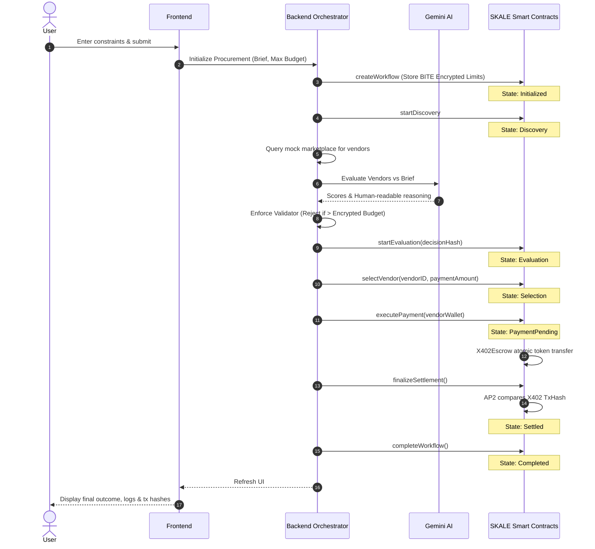

# Technical Architecture Specification
**Autonomous Procurement Agent**

---

## 1. Executive Summary
The Autonomous Procurement Agent is a decentralized, agent-driven procurement system operating on the SKALE Base Sepolia Testnet. It natively utilizes Google Gemini for qualitative AI evaluation, SKALE BITE for privacy-preserving constraints, the x402 pattern for deterministic escrow routing, and AP2 for cryptographic settlement. 

This document defines the architecture, components, and data flows of the system.

---

## 2. System Architecture

```mermaid
graph TB
    subgraph Client ["Client Layer"]
        Frontend[🖥️ Next.js Frontend UI]
    end

    subgraph AgentSystem ["Agent Layer (Node.js)"]
        Orchestrator[⚙️ Agent Orchestrator]
        Validator[🛡️ Decision Validator]
        Gemini[🤖 Gemini Eval (or Fallback)]
        VendorData[(📦 Mock Vendor Data)]
        ChainService[🔗 Blockchain Indexer/Service]
    end

    subgraph SKALENetwork ["SKALE Chain (Execution Layer)"]
        Workflow[📜 ProcurementWorkflow (ERC-8004)]
        X402[💰 X402Escrow]
        AP2[✅ AP2Settlement]
        Enc[🔐 EncryptionHelper]
        Registry[🪪 ERC-8004 Registry]
    end

    Frontend -- "Submit Request / Encrypt Constraints" --> Orchestrator
    Frontend -- "WebSocket/Poll State" --> ChainService
    
    Orchestrator -- "Query Vendors" --> VendorData
    Orchestrator -- "Evaluate Profiles" --> Gemini
    Gemini -- "Scores & Reasoning" --> Validator
    
    Validator -- "Commit Decision Hash" --> Workflow
    Orchestrator -- "Store BITE Encrypted Data" --> Enc
    
    Orchestrator -- "Authorize Exec" --> Workflow
    Workflow -- "Atomic Call" --> X402
    X402 -- "Fund Transfer" --> Vendors
    
    Workflow -- "Settle & Finalize" --> AP2
    AP2 -- "Verify Payment Proof" --> X402
    
    ChainService -- "Monitor Events" --> Workflow
    
    classDef ai fill:#4285f4,stroke:#1a73e8,color:#fff;
    classDef skale fill:#00d1c1,stroke:#00b3a4,color:#000;
    classDef contract fill:#1e1e1e,stroke:#00ffff,color:#00ffff;
    
    class Gemini ai;
    class X402,AP2,Enc skale;
    class Workflow,Registry contract;
```

---

## 3. Component Details

### 3.1 Frontend (Presentation Layer)
- **Tech Stack**: Next.js 15, React 19, TailwindCSS v4.
- **Purpose**: Provides a cyber-aesthetic user interface (UI) to capture procurement constraints (Brief, Budget, SLA) and displays the live feed of the workflow state directly sourced from the blockchain indexer. 
- **Key Modules**:
  - `WorkflowIntelligencePanel`: Surfaces AI reasoning and cryptographic verification status.
  - `AgentLiveFeed`: Renders real-time blockchain state transitions.

### 3.2 Backend Orchestrator (Agent Layer)
- **Tech Stack**: Node.js, Express, TypeScript.
- **Purpose**: Acts as the autonomous executor bridging off-chain intelligence with on-chain cryptographic settlement. Crucially, the orchestrator acts as a **Non-Authority**; it drives transactions but defers state ownership to the SKALE blockchain.
- **Key Modules**:
  - **GeminiEvaluator**: Generates deterministic logic prompts, routes data to Gemini 1.5 Flash, and enforces structured JSON schemas.
  - **Decision Validator (Hard Constraints)**: Protects against AI hallucinations by validating output strictly against maximum budget and minimum SLA, entirely overriding Gemini if violations occur.
  - **BlockchainService**: Signs transactions, pays gas via testnet configs, estimates gas, manages nonces, and strictly fetches "source of truth" workflow states from the contracts.
  - **EncryptionService**: Drives BITE integration using AES-256-GCM to securely conceal decision weights.

### 3.3 Smart Contracts (Execution Layer)
- **Tech Stack**: Solidity ^0.8.24, Hardhat, SKALE Native x402 / AP2 Specs.
- **Purpose**: Deterministic execution, state tracking, and token disbursement.
- **Contracts**:
  - `ProcurementWorkflow`: Main ERC-8004 agent contract dictating the state machine, committing decision hashes, and triggering AP2 hooks.
  - `X402Escrow`: Holds DemoUSDC or native CREDIT tokens, releases funds exactly when instructed by `ProcurementWorkflow`, and generates unique transaction hashes based on blocks. Protected by `ReentrancyGuard`.
  - `AP2Settlement`: Cryptographic settlement verification. Queries `X402Escrow` synchronously to ensure payments physically settled before finalizing workflow completion.
  - `EncryptionHelper`: Handles on-chain storage of BITE AES data with access control, ensuring irreversible public commitments with privacy.

---

## 4. Sequence & Data Flow



---

## 5. Security & Privacy Architecture

### 5.1 SKALE BITE (Blockchain Integrated Trust Environment)
Privacy is integrated into the procurement loop leveraging **symmetric encryption (AES-256-GCM)**. 
- The constraints (e.g., max budget, SLA threshold) are encrypted dynamically in the backend using a securely stored `ENCRYPTION_KEY`.
- The `iv`, `tag`, and `ciphertext` are packed and permanently attached to the workflow on `createWorkflow`.
- The evaluator uses the decrypted criteria offline, selecting the vendor. The blockchain verifies the encrypted hash is unchanged via `EncryptionHelper.verifyDataHash`, granting total privacy to strategic procurement weights until explicitly unlocked post-settlement.

### 5.2 Constraint Validations (Anti-Hallucination)
The architecture prevents AI unreliability mechanically:
- **AI scope:** The AI only returns theoretical rankings based on textual alignment with the procurement brief.
- **Engine scope:** Traditional code (DecisionValidator) slices AI output and forces mathematical compliance strictly against the max budget constraint. Overrides are structurally hard-coded.

### 5.3 Deterministic Replay Protection & Escalation
- All on-chain state stages are protected with the `inState` modifier, preventing step-skipping or concurrent race conditions.
- `AP2Settlement` guarantees that a vendor cannot be marked "Settled" unless the blockchain execution layer physically verifies `payment.executed == true` against the `X402Escrow` ledger mapping.
- Native `require` statements prevent replay attacks on settlements and completions.
